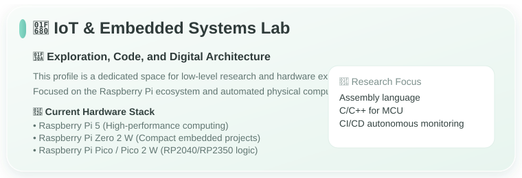
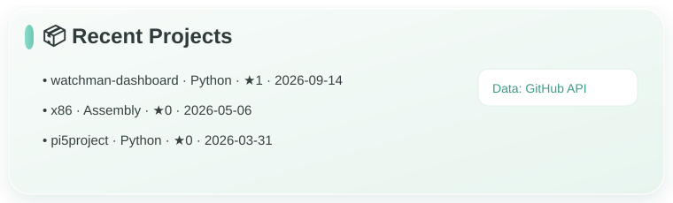
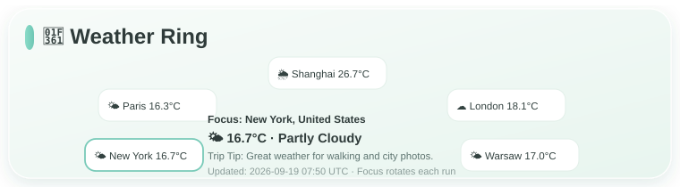

# Hi, I'm NoaArkeu 👋

  

  <em>Passion deserves to be seen ✨</em>

<!-- GENERATED_CARDS_START -->

  

  

  

<!-- GENERATED_CARDS_END -->

---

### About
- Python / Backend / Automation
- IoT & Embedded exploration
- Building cute + practical interfaces

### Links
- Interactive site: https://noaarkeu.github.io/noaarkeu-site/
- GitHub: https://github.com/NoaArkeu